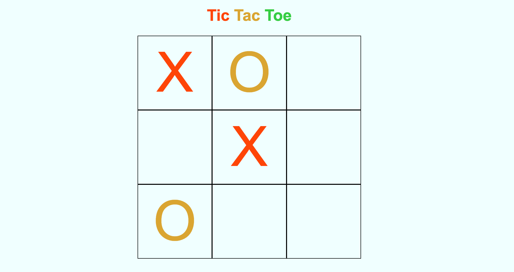

# Tic Tac Toe
Week 10 assignment for General Assembly's intro to front end web development course. Used simple conditional statements to check whose turn it was and check if a player has won yet. Added CSS delays and transitions to make it more fun.

Deployed [here](https://penelopecj.github.io/tic-tac-toe/).